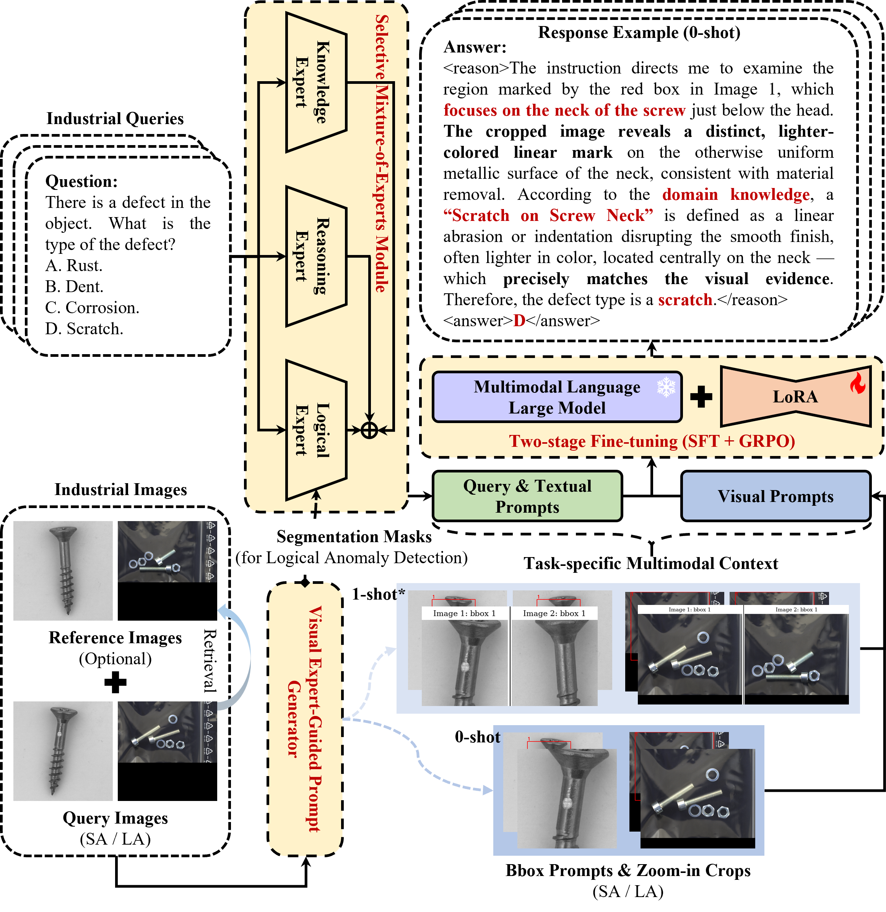

# CoExpert-AD

## Overview of CoExpert-AD



## Data Organization

- Refer to https://github.com/jam-cc/MMAD

```text
data/
├── DS-MVTec/           # MVTec-AD dataset
│   ├── bottle/         # catalogy files
│   │   ├── ...
│   │   └── ...
│   └── ...
│
├── GoodsAD/            # GoodsAD dataset
│   ├── cigarette_box/  # catalogy files
│   │   ├── ...
│   │   └── ...
│   └── ...
├── .../
│
└── mmad_eval.json      # eval files
```

## How to start

- Set up the environment as specified in **requirements.txt**.

- Prepare the dataset and organise it as **Data Organization**.

- Configure the relevant models in
```
python lmm_eval.py
```


- Run the following code to evaluate.

```
python lmm_eval.py
```

